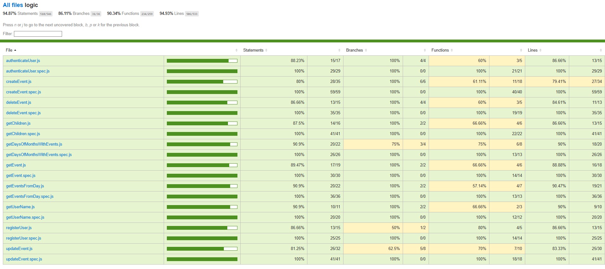

# Calendario Familiar App

## Intro

Calendario - MiLittleCal was born out of the need to efficiently organize all the activities and events for my daughters. This tool allows you to create, edit, and delete events easily, ensuring that no doctor’s appointment, school activity, or special moment is ever missed. With an intuitive and practical design, MiLittleCal makes managing family life simple and efficient, even on the busiest days.

[Overwhelmed Mom Juggling Family Chaos]

## Functional

### Use Cases

User
- add event
- edit event
- delete event
- view event

Upcoming Features
- view calendar and events (with filter)
- edit profile (phone, email, kids...)

### UXUI Design

#### Views

- Landing
- Login
- Register
- Home
    - Calendar
        - Event List 
    - Create Event
    - Edit Event

[Figma](https://www.figma.com/design/xGP5aGUHmWJpdDuCZcgSCQ/Untitled?node-id=1-2&p=f&t=MKfVtxfkh91OW6ML-0)

## Technical

### Blocks

- App
- API
- DB

### Packages

- app
- api 
- doc (documentation)

### Techs

- HTML/CSS/JS
- React
- Node/Express
-...

### Data Model

User
- id (uuid)
- name (string)
- email (string)
- password (string)

Child
- id (uuid)
- parent (User.id)
- name (string)

Event
- id (uuid)
- author (User.id)
- children ([Child.id])
- title (string)
- description (string)
- date (Date)

### Coverage
![Code Coverage]
## Tasks

[GitHub] (https://github.com/b00tc4mp/isdi-parttime-202410/issues/49)